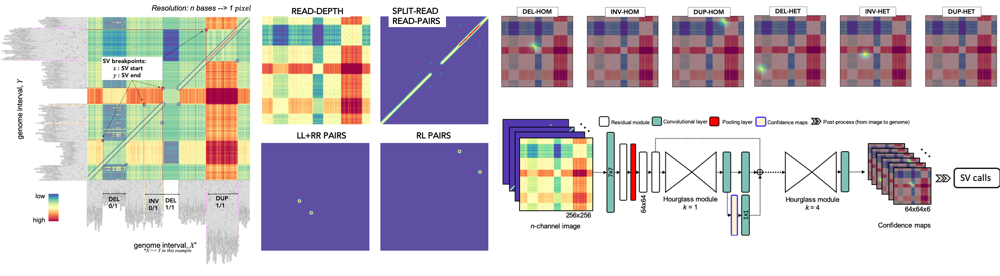
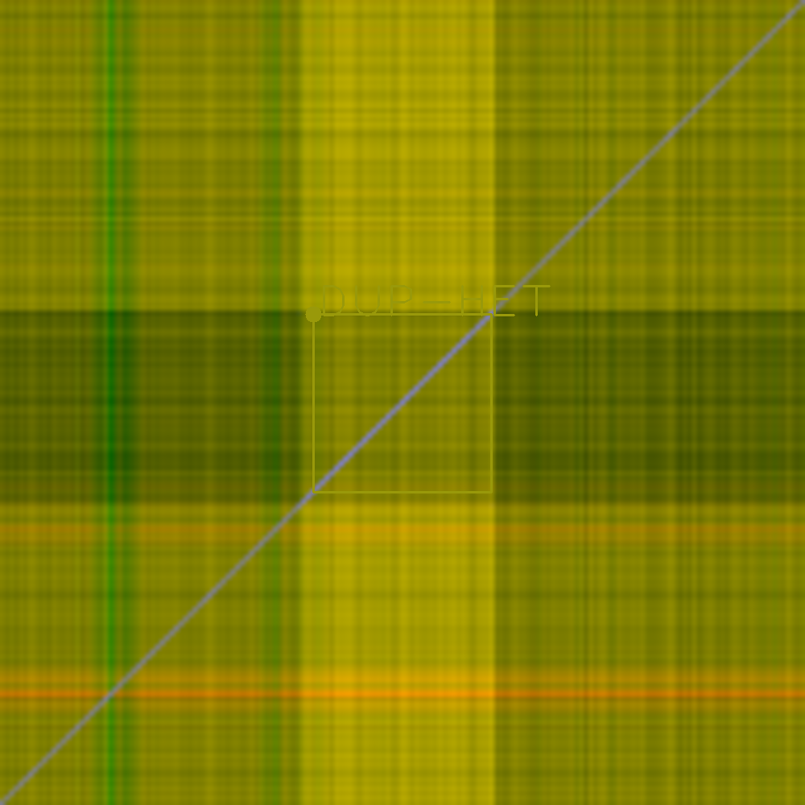
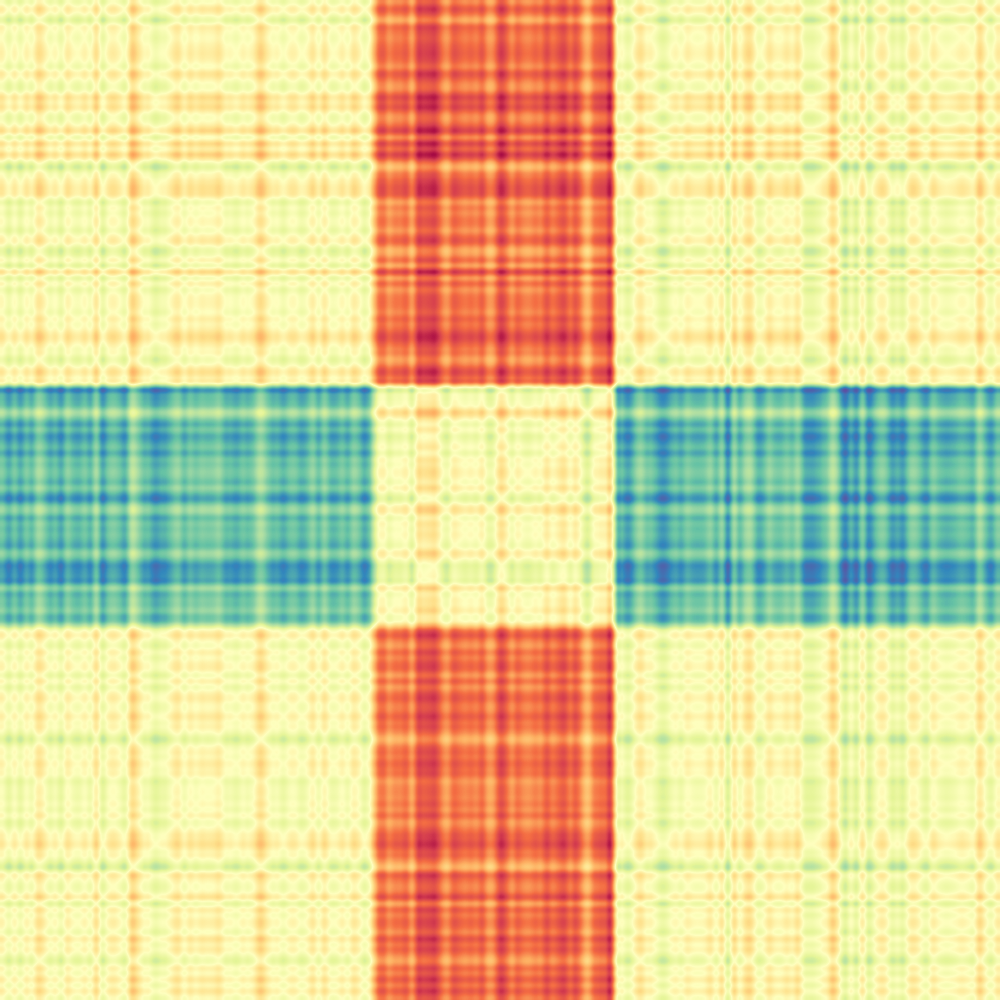
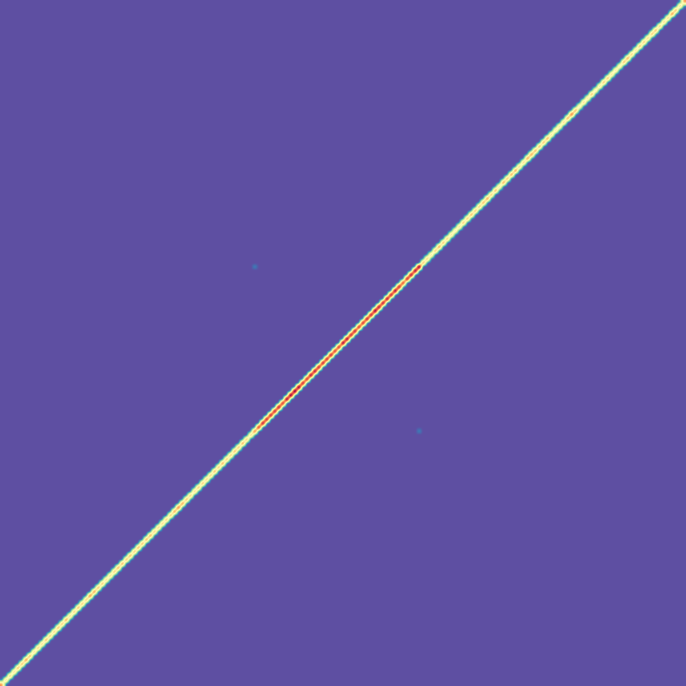
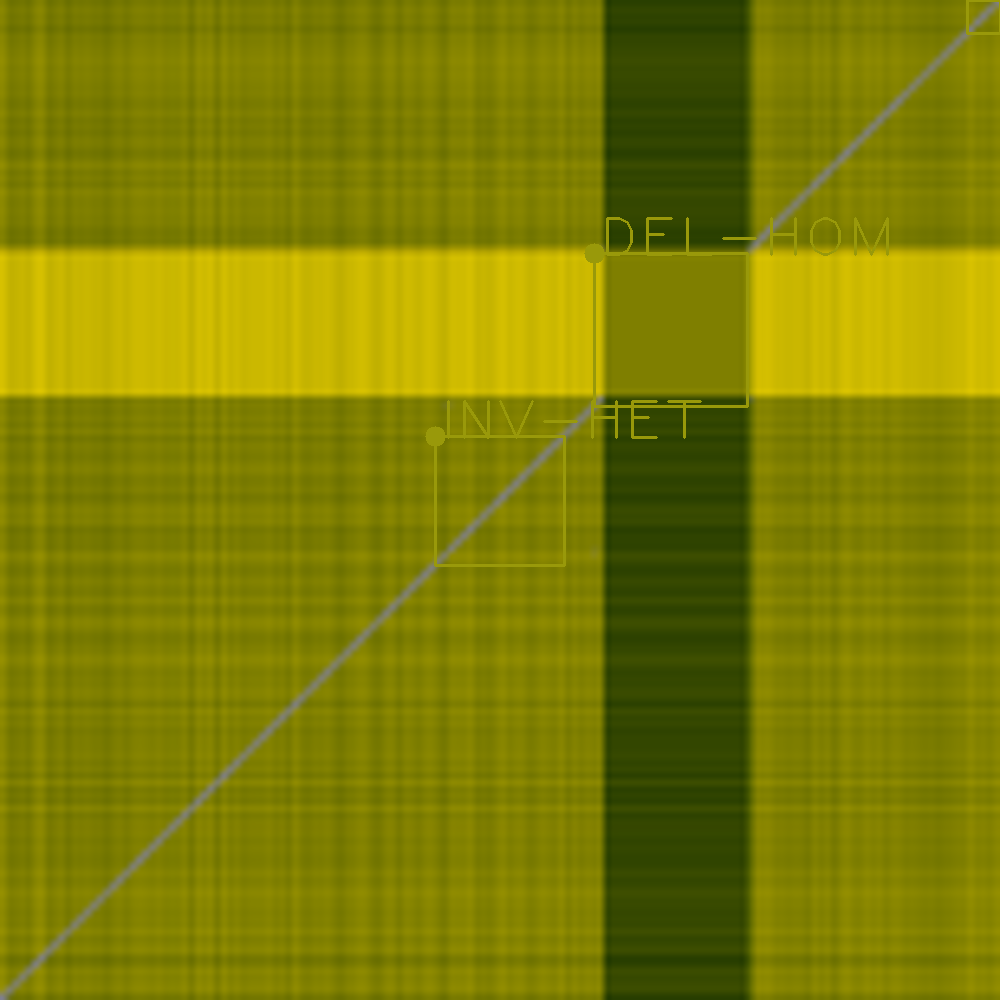
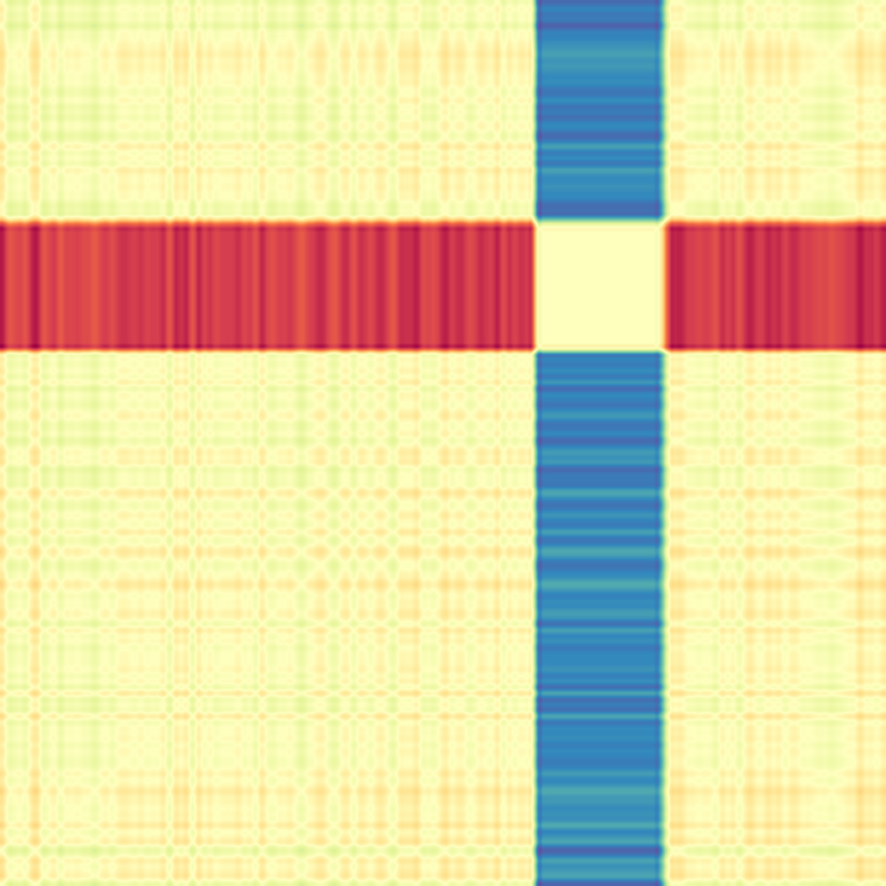
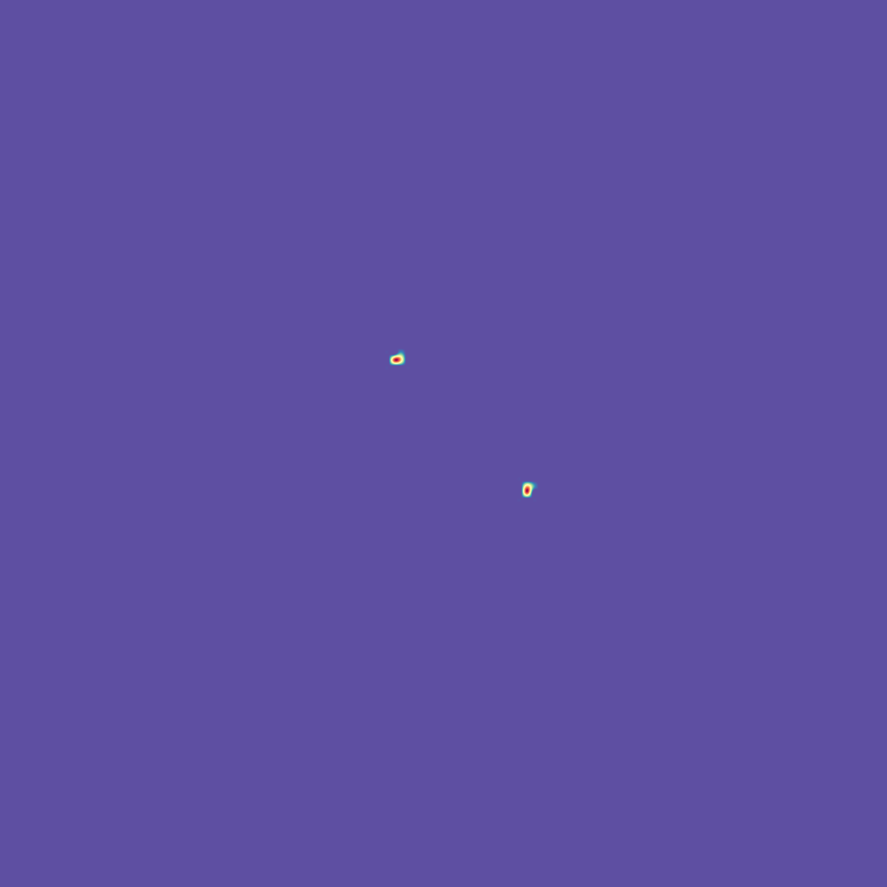
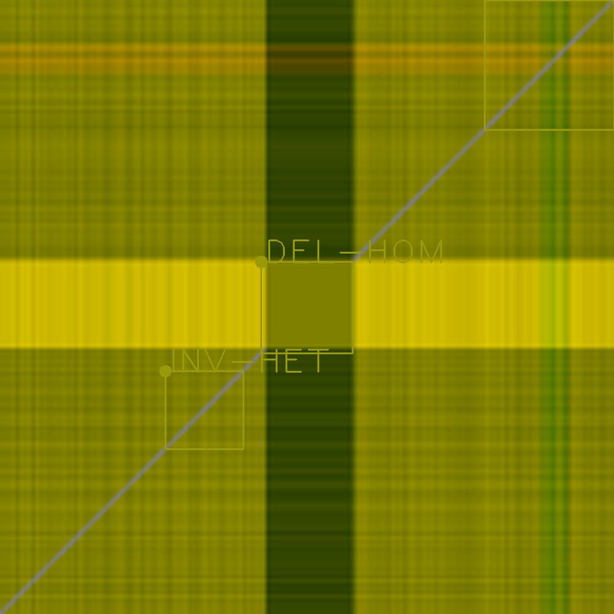
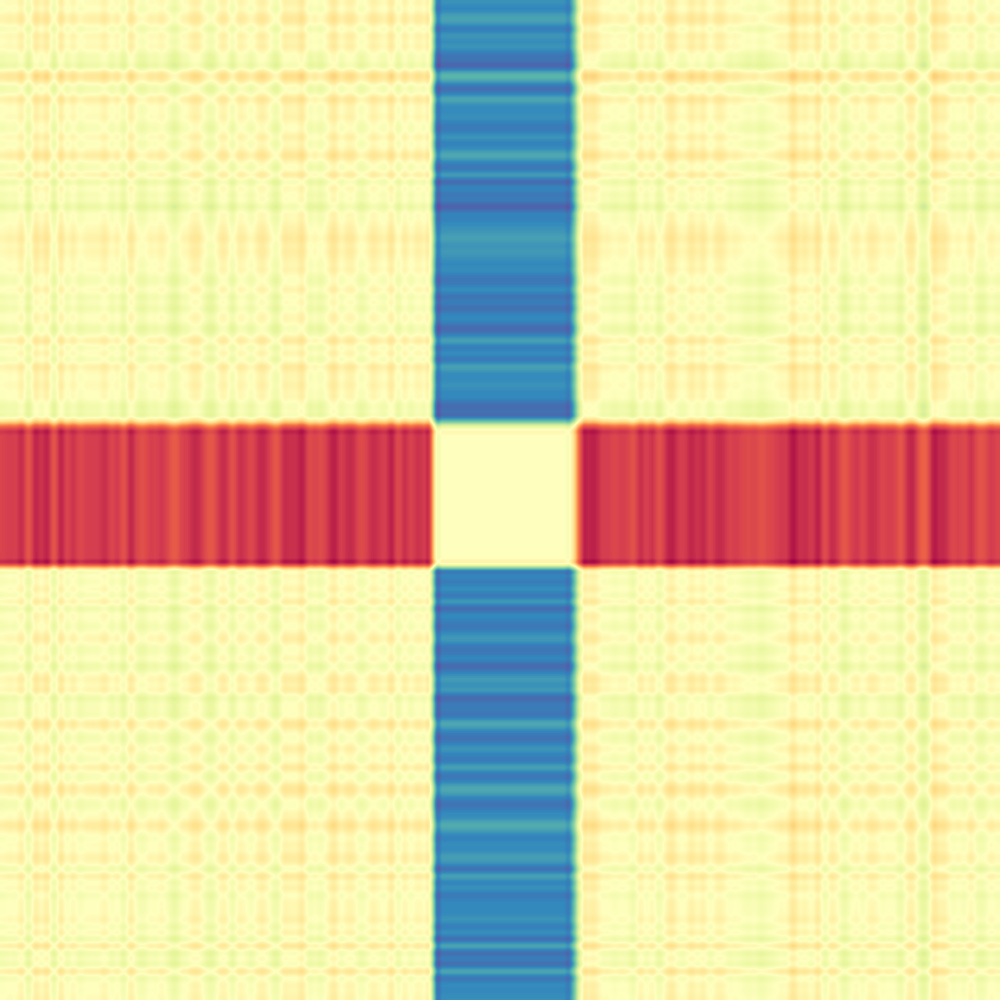
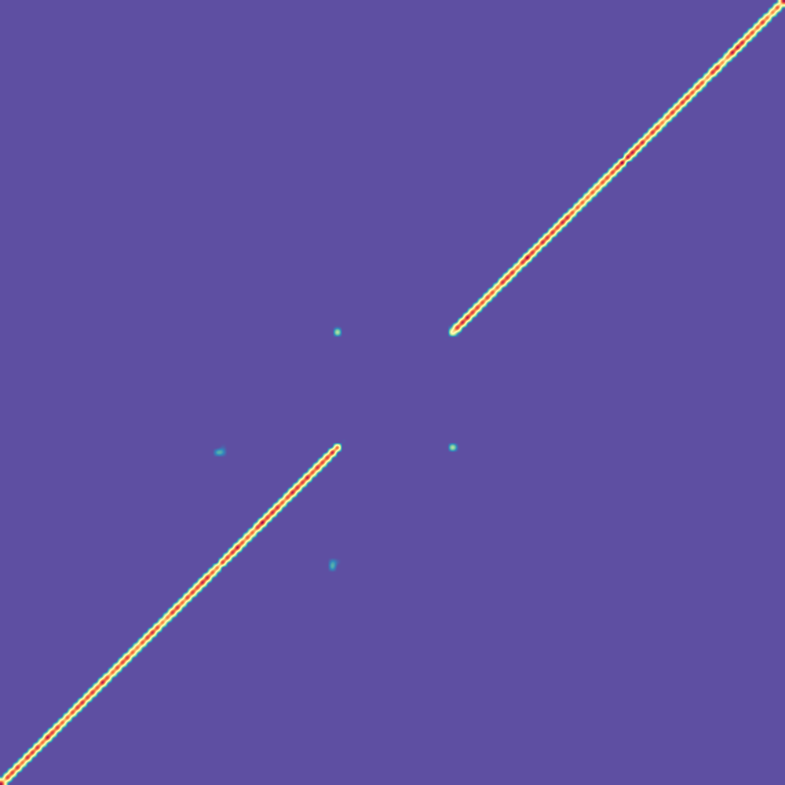

# Cue: a deep learning framework for SV calling and genotyping

##### Table of Contents  
[Overview](#overview)  
[Installation](#install)  
[Demo / Tutorial](#demo)  
[Execution](#structure)  
[Recommended workflow](#workflow)     
  
<a name="overview"></a>
### Overview

```cue``` is a deep learning framework for SV calling and genotyping. At a high-level, ```cue``` operates 
in the following stages illustrated in the figure below: 
* sequence alignments are converted into images that capture multiple alignment signals across two genome intervals, 
* a trained neural network is used to generate Gaussian response confidence maps for each image, 
which encode the location, type, and genotype of the SVs in this image, and 
* the high-confidence SV predictions are refined and mapped back from image to genome coordinates.

<p align="center">

</p>

The current version of ```cue``` can be used to detect and genotype the following SV types: 
deletions (DELs), tandem duplication (DUPs), inversions (INVs), deletion-flanked inversions (INVDELs), 
and inverted duplications (INVDUPs) larger than 5kbp. 

For more information please see the following [preprint](https://www.biorxiv.org/content/10.1101/2022.04.30.490167v1) 
and [video](https://www.youtube.com/watch?v=EVlLqig3qEI).

<a name="install"></a>
### Installation

* Clone the repository:
```git clone git@github.com:PopicLab/cue.git```

#### Setup a Python virtual environment (recommended)

* Create the virtual environment (in the env directory): 
```$> python3.7 -m venv env```

* Activate the environment:
```$> source env/bin/activate```

* Install all the required packages in the virtual environment (this should take a few minutes):  
```$> pip --no-cache-dir install -r install/requirements.txt```  
Packages can also be installed individually using the recommended versions 
provided in the ```install/requirements.txt``` file; for example:
```$> pip install numpy==1.18.5```

* Set the ```PYTHONPATH``` as follows: ```export PYTHONPATH=${PYTHONPATH}:/path/to/cue```

<a name="demo"></a>
### Demo

We recommend trying the following demo/tutorial to ensure that the software was properly installed 
and to experiment running ```cue```. In this demo we will use ```cue``` to discover variants in 
a small BAM file provided here: ```data/demo/inputs/chr21.small.bam```. 
This file contains alignments to a region of ```GRCh38``` ```chr21``` of short reads from a synthetic genome. 
The ground-truth variants simulated in this region of the genome are provided here: 
```data/demo/ground_truth/svs.chr21.small.vcf.gz```.
The associated YAML config files needed to execute this workflow are provided 
in the ```data/demo/exec``` directory.
The expected results are provided in the ```data/demo/expected_results``` directory. 
All commands should be executed from the top-level directory of the ```cue``` repository.

1. To call variants given the input BAM file and the provided pretrained ```cue``` model on a single CPU:   
```python engine/call.py --data_config data/demo/exec/data.yaml --model_config data/demo/exec/model.yaml```

This command will launch ```cue``` in variant discovery mode. The input BAM file will first be indexed and 
then the genome will be scanned to generate images and make predictions. 
This process should take about 5-6 minutes in total on one CPU. This command can be executed on the GPU by providing 
the desired GPU id in the ```gpu_ids``` field of the ```data/demo/exec/model.yaml``` file. 
For example, to run on GPU 0, set this field as follows: ```gpu_ids: [0]```. Multiple GPU ids can be provided 
to parallelize SV calling across multiple devices when running on a full-genome dataset.

The output of the program will be generated in the ```data/demo/exec``` directory (generally ```cue``` writes 
the results of each command in the parent folder of the provided YAML config files). 
In particular, the discovered SVs will be provided here: ```data/demo/exec/reports/svs.vcf ``` 
(```cue``` outputs both a BED and a VCF file with results).

For example, here are three SVs discovered by the model ranked by confidence score (given in ```QUAL``` column). 

```
#CHROM  POS     ID      REF     ALT     QUAL    FILTER  INFO    FORMAT  SAMPLE
chr21   10399416        DUP     N       <DUP>   86      PASS    END=10427813;SVTYPE=DUP;SVLEN=28398     GT      0/1
chr21   14855666        INV     N       <INV>   82      PASS    END=14870587;SVTYPE=INV;SVLEN=14922     GT      0/1
chr21   14874025        DEL     N       <DEL>   82      PASS    END=14891603;SVTYPE=DEL;SVLEN=17579     GT      1/1 
```

2. (Optional) To visualize the SVs results:  

```python engine/view.py --config data/demo/exec/view.yaml```

This command will generate annotated ```cue``` images and separate image channels centered around each discovered SV.
These channels can be used to evaluate various alignment signals contributing to each SV call.

For example, here are the annotations and channels produced for the above three events 
(note that other events may appear in the same image if they are nearby).

```DUP: chr21   10399416-10427813```

|       Annotation          |        READ-DEPTH         |   SPLIT-READ/READ-PAIRS  |         LL+RR PAIRS        |          RL PAIRS         |
|:-------------------------:|:-------------------------:|:-------------------------:|:-------------------------:|:-------------------------:|
| |   |   |   |   | 

```INV: chr21   14855666-14870587```

|       Annotation          |        READ-DEPTH         |   SPLIT-READ/READ-PAIRS  |         LL+RR PAIRS        |          RL PAIRS        |
|:-------------------------:|:-------------------------:|:-------------------------:|:-------------------------:|:-------------------------:|
|  |   |   |   |  |


```DEL: chr21   14874025-14891603```

|       Annotation          |        READ-DEPTH         |   SPLIT-READ/READ-PAIRS  |         LL+RR PAIRS        |          RL PAIRS         |
|:-------------------------:|:-------------------------:|:-------------------------:|:-------------------------:|:-------------------------:|
|  |   |   |   |  |


3. (Optional) To evaluate the results against the ground truth SVs using Truvari:

In order to execute Truvari, we need to post-process the produced VCF to the input format required by Truvari; 
in particular, we need to sort, compress, and index the SV VCF file. We recommend using ```bcftools``` and ```htslib``` 
for this task as follows.  

a. Sort the VCF by position: ```bcftools sort data/demo/exec/reports/svs.vcf > data/demo/exec/reports/svs.sorted.vcf```   
b. Compress the sorted VCF: ```bgzip -f data/demo/exec/reports/svs.sorted.vcf```   
c. Index the compressed VCF: ```bcftools index -t data/demo/exec/reports/svs.sorted.vcf.gz```  

We can now execute Truvari as follows:  
```truvari bench -b data/demo/ground_truth/svs.chr21.small.vcf.gz -c data/demo/exec/reports/svs.sorted.vcf.gz -o data/demo/expected_results/reports/truvari --pctsize=0.5 --pctov=0.5 --passonly --sizemax 5000000 --pctsim 0 --gtcomp```  

Truvari will report the precision, recall, and F1 score for this small benchmark. 
The above command will require a genotype match to consider an SV call a true positive (TP).

Here is a snapshot of the Truvari report: 
```
"TP-base": 16,
"TP-call": 16,
"FP": 0,
"FN": 1,
"precision": 1.0,
"recall": 0.9411764705882353,
"f1": 0.9696969696969697,
"base cnt": 17,
"call cnt": 16
```

We can see that ```cue``` discovered 16 out of the 17 events simulated in this region (with no false positives).
Additional information produced by Truvari can be found here: ```data/demo/expected_results/reports/truvari```. 


<a name="structure"></a>
### Execution

In addition to the functionality to call structural variants, the framework can be used to execute custom model training, evaluation, and image generation. The ```engine``` directory contains the following key high-level scripts to train/evaluate the model 
and generate image datasets:

* ```generate.py```: creates an annotated image dataset from alignments (BAM file(s))
* ```train.py```: trains a deep learning model (currently, this is a stacked hourglass network architecture) 
to detect SV keypoints in images
* ```call.py```: calls structural variants given a pre-trained model and an input BAM file 
(can be executed on multiple GPUs or CPUs)
* ```view.py```: plots images annotated with SVs from a VCF/BEDPE file given genome alignments (BAM format);
can be used to visualize model predictions or ground truth SVs 

Each script accepts as input one or multiple YAML config files, which encode a variety of parameters. Template config files are provided 
in the ```config``` directory.

<a name="workflow"></a>
#### Recommended workflow 

1. Create a new directory.
2. Place YAML config file(s) in this directory (see the provided templates).
3. Populate the YAML config file(s) with the parameters specific to this experiment.
4. Execute the appropriate ```engine``` script providing the path to the newly configured YAML file(s).
The engine scripts will automatically create auxiliary directories with results in the folder where the config YAML files are located.
